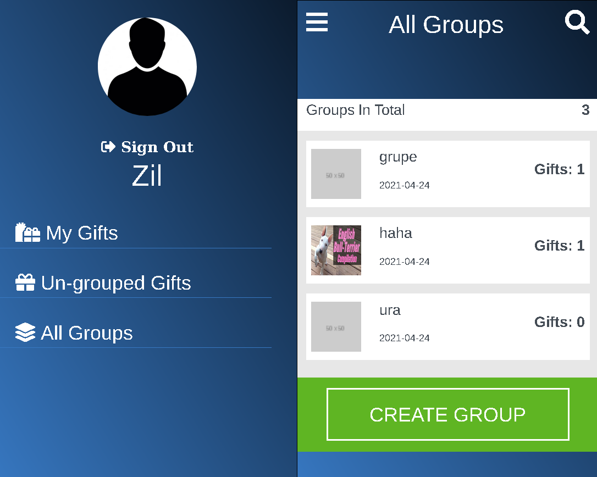

# Gift Grouping
Gift Grouping is a mobile-only app where you can sign up (and/or sign in), create groups and add gifts. View created groups created by all users and view only signed in user's added gifts.



## Built With

- Ruby 2.7.2
- Ruby on Rails 6.1.3

## Live Demo

[Live demo](https://grouping-app.herokuapp.com)

## Getting Started

To get a local copy up and running follow these simple example steps.

### Prerequisites

- Ruby: 2.7.2 
- Rails: 6.1.3
- Postgres: 13.2
- Rspec-rails
- Capybara
- Shoulda-matchers

### Setup

Instal gems with:

```
$ bundle install
```

Setup database with:

```
$ rails db:create
$ rails db:migrate
```

## Testing

> To test all models, write the following in your terminal:

```
$ rspec spec/models
```

> To test all features, write the following in your terminal:

```
$ rspec spec/features
```


## Usage

Start server with:

```
$ rails s
```

 In your browser, navigate to: 
 ```
 http://localhost:3000/
 ```

## AUTHOR

**ZIL NORVILIS**

- Github: [](https://github.com/zilton7)
- Linkedin: [](https://www.linkedin.com/in/zil-norvilis/)
- Twitter: [](https://twitter.com/devnor7)


## Show your support

Give a ⭐️ if you like this project!

## Acknowledgments

- Hat tip to anyone whose code was used.
- Inspiration
- etc
